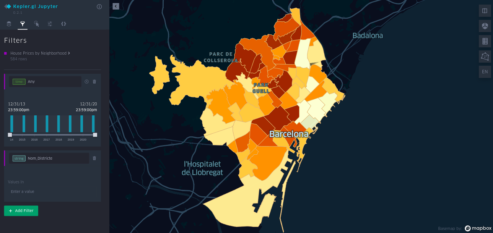

## Visualization with Kepler widget

The aim of this project is to create an interactive heatmap that will show the evolution of house market prices in Barcelona by neighborhoods.

* years from 2013 to 2020
* 73 neighborhoods
* 10 districts

In the "neighborhoods_map.ipynb" script:

1. We have extracted the geometry feature from the .geojson file and have added it to every year csv file.
2. We have concatenated all csv files into a single one.
3. We create a new feature with _datetime_ format
4. We fit the thw widget with the data.
4. Ready to **play** around with filters!

